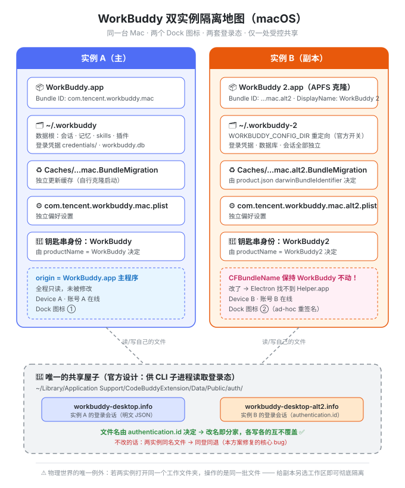
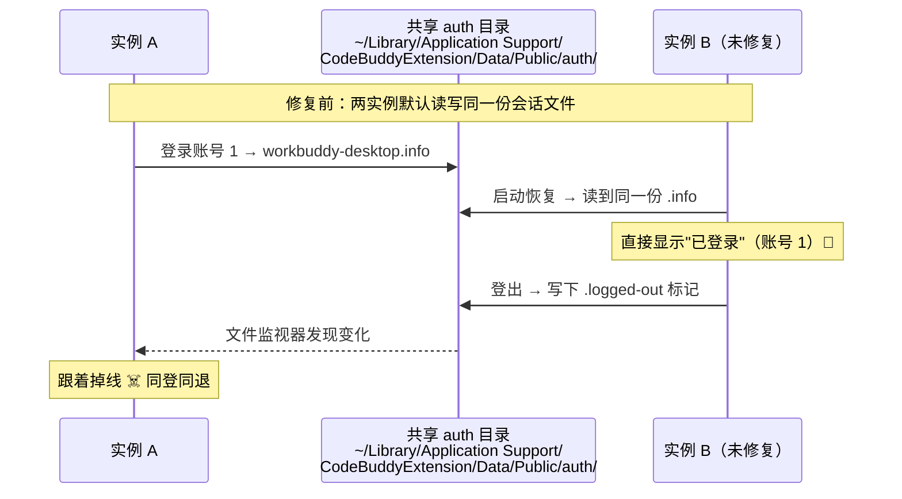
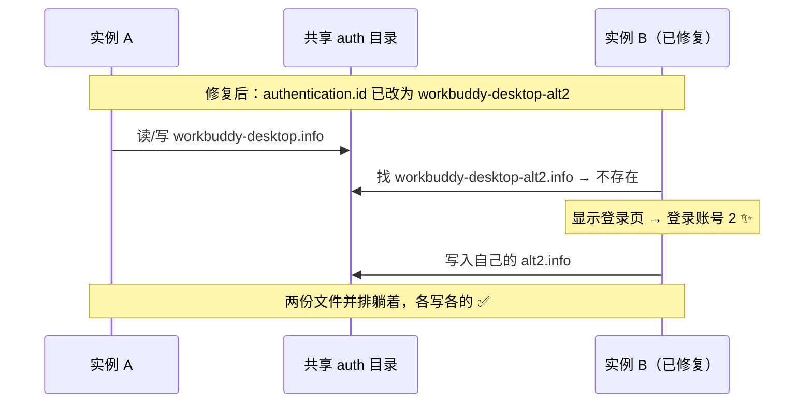

# WorkBuddy 双开指南 · WorkBuddy Multi-Instance on macOS


> 📌 **最近更新 · v1.2.0（2026-09-20）**：新增 [Windows 可行性探讨](docs/windows.md)
> （从 macOS 包逆向出的实证 + 推演路线 + 三个未知）；
> 上一版 v1.1.0 同步了 5.5.6 实战（跨版本升级、登录态保留、脚本三增强）。
> 完整迭代记录见 [CHANGELOG.md](CHANGELOG.md)。

> **在同一台 Mac 上同时运行两个 WorkBuddy，登录两个不同账号，数据完全隔离。**
> 不破解、不注入、不魔改二进制 —— 全部利用 WorkBuddy 官方留出的配置开关，一个字节的主程序代码都不改，随时可完整回退。

- 🎯 **效果**：Dock 上两个独立图标 · 两个账号同时在线 · 登出互不影响
- 🧩 **原理**：官方环境变量 `WORKBUDDY_CONFIG_DIR` + 三处身份配置改写
- 🤖 **懒人路线**：把 [AGENT.md](AGENT.md) 丢给任何 AI 助手，全自动部署
- 🧪 **5.5.2 / 5.5.3 / 5.5.6 实测通过**，双开 → 双账号 → 双账号领券全链路验证（含跨版本升级 5.5.2 → 5.5.6 实测）

---

## 目录

- [你将得到什么](#你将得到什么)
- [隔离地图：两个实例到底哪里不同](#隔离地图两个实例到底哪里不同)
- [为什么默认不能双账号？（一个精彩的反转）](#为什么默认不能双账号一个精彩的反转)
- [快速开始](#快速开始)
- [手动全流程（6 步）](#手动全流程6-步)
- [两种方案怎么选](#两种方案怎么选)
- [升级与回退](#升级与回退)
- [踩坑速查表](#踩坑速查表)
- [FAQ](#faq)
- [免责声明](#免责声明)
- [更新日志](CHANGELOG.md)
- [Windows 可行性探讨](docs/windows.md)（未实测）

---

## 你将得到什么

| | 实例 A（主） | 实例 B（副本） |
|---|---|---|
| 程序本体 | `/Applications/WorkBuddy.app` | `/Applications/WorkBuddy 2.app` |
| Dock 图标 | WorkBuddy | **WorkBuddy 2**（独立图标，Cmd+Tab 分得清） |
| 登录账号 | 账号 A | 账号 B（首次启动后重新登录） |
| 数据目录 | `~/.workbuddy` | `~/.workbuddy-2` |
| 会话/记忆/技能/插件 | 实例 A 自己的 | 实例 B 自己的 |
| 登出/切换账号 | 不影响 B | 不影响 A |

## 隔离地图：两个实例到底哪里不同

**只有右下角那一间"共享屋子"是两个实例都摸得到的** —— 但屋里两个文件各写各的名字，互不覆盖。这就是整个方案的全部秘密。

<p align="center">
  
</p>

逐项清单（✅ = 完全独立）：

| 存储位置 | 实例 A | 实例 B | 独立？ |
|---|---|---|---|
| 程序本体 | `WorkBuddy.app` | `WorkBuddy 2.app` | ✅ |
| 数据根目录 | `~/.workbuddy` | `~/.workbuddy-2` | ✅ |
| 更新缓存 | `~/Library/Caches/com.tencent.workbuddy.mac.BundleMigration` | `…mac.alt2.BundleMigration` | ✅ 注：5.5.6 起官方疑似不再生成此目录（实测两侧均无），但 `darwinBundleIdentifier` 仍须改 |
| 偏好设置 | `com.tencent.workbuddy.mac.plist` | `…mac.alt2.plist` | ✅ |
| 登录会话文件 | `workbuddy-desktop.info` | `workbuddy-desktop-alt2.info` | ✅ 同目录不同文件 |
| 钥匙串身份 | productName `WorkBuddy` | productName `WorkBuddy2` | ✅ |
| ⚠️ 你的工作文件夹 | 若两边打开同一目录 → 操作同一批文件（物理规律，无法隔离） | | — |

## 为什么默认不能双账号？（一个精彩的反转）

直接复制一份 app 双开是**不行**的 —— 你会撞上一个幽灵现象：副本一打开"就已经登录了主账号"，而且**任一边登出，另一边跟着掉线**（同登同退）。

第一直觉会怀疑"服务器把两个客户端绑定了"。但真相在本地，用 `lsof` 扒开进程就能看到决定性证据：



官方源码注释原话：*"Stores authentication session in a shared location that can be accessed by CLI subprocesses"* —— 为了让命令行子进程共享登录态，会话文件被**故意**放在所有实例共享的目录，文件名取自配置项 `authentication.id`（默认所有实例同名）。所以修复 = 给副本换一个文件名，共三处配置（下称**三件套**）：



三个身份配置各自管一摊，缺一个都会串号：

| 配置（副本 `product.json` 内） | 改成 | 管什么 |
|---|---|---|
| `productName` | `WorkBuddy2` | 应用名 → 钥匙串身份 |
| `darwinBundleIdentifier` | `com.tencent.workbuddy.mac.alt2` | 更新缓存目录名（**它不读运行时 Bundle ID**，所以光改 Info.plist 没用） |
| `authentication.id` | `workbuddy-desktop-alt2` | 共享 auth 会话文件名 ← **同登同退的真凶** |

> 注意 `applicationName` **不要改** —— 它只影响 userAgent，改了可能被服务端拒绝。

## 快速开始

### 路线一：让 AI 干（推荐 🌟）

把下面这句话 + [AGENT.md](https://raw.githubusercontent.com/ccccplus/workbuddy-multi-instance/main/AGENT.md) 的内容发给任何 AI 编程助手（WorkBuddy、Cursor、Claude Code 均可）：

> 请严格按照 AGENT.md 的流程，在我的 Mac 上部署 WorkBuddy 双开。

AI 会自动完成环境检查 → 执行一键脚本 → 逐项验证 → 提示你登录，全程可回滚。

### 路线二：一行命令

```bash
curl -fsSL https://raw.githubusercontent.com/ccccplus/workbuddy-multi-instance/main/scripts/setup-workbuddy-2.sh | bash
```

装完跑一下自检：

```bash
curl -fsSL https://raw.githubusercontent.com/ccccplus/workbuddy-multi-instance/main/scripts/verify-isolation.sh | bash
```

### 路线三：手动全流程

见下一节 —— 想搞懂每一步在干什么的话，值得读一遍。

## 手动全流程（6 步）

### 第 1 步 · 克隆主 app

```bash
cp -R "/Applications/WorkBuddy.app" "/Applications/WorkBuddy 2.app"
```

APFS 克隆，约 2 秒。原 app 从头到尾只被读取。

### 第 2 步 · 改 Info.plist（两改一不改）

```bash
cd "/Applications/WorkBuddy 2.app/Contents"
plutil -replace CFBundleIdentifier  -string "com.tencent.workbuddy.mac.alt2"  Info.plist
plutil -replace CFBundleDisplayName -string "WorkBuddy 2"                     Info.plist
plutil -replace LSEnvironment.WORKBUDDY_CONFIG_DIR -string "$HOME/.workbuddy-2" Info.plist
```

- `CFBundleIdentifier` → 独立 Dock 图标 / 缓存 / 偏好设置
- `CFBundleDisplayName` → Dock 显示"WorkBuddy 2"
- `LSEnvironment.WORKBUDDY_CONFIG_DIR` → 数据树整体搬家（官方开关）
- 🚨 **`CFBundleName` 保持 `WorkBuddy` 绝对不改！** Electron 按 `CFBundleName + " Helper"` 在 `Contents/Frameworks/` 里找辅助进程（`WorkBuddy Helper.app` 等四个）。改了它 → 启动即 `FATAL: Unable to find helper app`，**Dock 有图标但永远没有窗口**（没有报错弹窗，极难排查）。

### 第 3 步 · 改 product.json 三件套（防串号，最关键）

```bash
/usr/bin/python3 - "/Applications/WorkBuddy 2.app/Contents/Resources/app.asar.unpacked/cli/product.json" <<'PY'
import json, sys
p = sys.argv[1]
d = json.load(open(p))
d['productName'] = 'WorkBuddy2'                                   # 钥匙串身份
d['darwinBundleIdentifier'] = 'com.tencent.workbuddy.mac.alt2'    # 独立更新缓存
d.setdefault('authentication', {})['id'] = 'workbuddy-desktop-alt2'  # 独立登录会话
json.dump(d, open(p, 'w'), ensure_ascii=False, indent=2)
PY
```

这个文件在 `app.asar.unpacked` 里，是明文 JSON，直接改。

### 第 4 步 · 重签名 + 清隔离属性

改了 app 内任何文件，签名就失效了，macOS 会把它当"已损坏"：

```bash
rm -rf "/Applications/WorkBuddy 2.app/Contents/PlugIns/WechatShare.appex/Contents/_CodeSignature"
codesign --force --deep --sign - "/Applications/WorkBuddy 2.app"   # ad-hoc，无需开发者账号
xattr -cr "/Applications/WorkBuddy 2.app"                          # 清 quarantine / provenance
```

### 第 5 步 · 注册并启动

```bash
/System/Library/Frameworks/CoreServices.framework/Frameworks/LaunchServices.framework/Support/lsregister \
  -f -R "/Applications/WorkBuddy 2.app"
open -a "/Applications/WorkBuddy 2.app"
```

### 第 6 步 · 登录第二个账号

新实例是干净的未登录状态，扫码登录即可。验证成功的标志：

```bash
# 共享 auth 目录里出现副本自己的会话文件（与主实例的并排躺着）
python3 -c "import os; print(os.listdir(os.path.expanduser(
  '~/Library/Application Support/CodeBuddyExtension/Data/Public/auth')))"
# → ['workbuddy-desktop.info', 'workbuddy-desktop-alt2.info', ...]
```

最后一测：**在副本里登出 → 主实例应该纹丝不动**。通过，大功告成 ✅

## 两种方案怎么选

| | 方案 A：完整副本（本文档主推） | 方案 B：轻量启动器 |
|---|---|---|
| 原理 | 克隆 app + 改身份 | 一行环境变量启动原二进制 |
| 额外空间 | ≈ 1 GB（APFS 克隆实际占用更低） | 0 |
| Dock 图标 | ✅ 独立图标 | ❌ 与主实例共用 |
| 登录态隔离 | ✅ 配合三件套彻底隔离 | ✅（数据目录已分家） |
| 稳定性 | launchd 正规启动，双击即用 | 进程易被终端会话回收 |
| 升级维护 | 主 app 升级后需重跑 setup 脚本 | 自动跟随 |
| 适合 | **长期双账号** | 临时验证/试用 |

<details>
<summary>方案 B 的启动器怎么做（点开）</summary>

用"脚本编辑器"或 `osacompile` 生成一个 20 KB 的小 app，内容一行：

```zsh
WORKBUDDY_CONFIG_DIR="$HOME/.workbuddy-2" /Applications/WorkBuddy.app/Contents/MacOS/Electron &
```

零体积、随时删，但两个窗口挤在同一个 Dock 图标下 —— 临时测试够用，长期不建议。

</details>

## 升级与回退

**主 app 自动更新后，副本会停在旧版本**（两套 app 各是各的文件）。副本**不参与**官方自动更新，这是刻意的：官方更新器会用原版包覆盖掉我们的三件套补丁，隔离会当场失效。所以正确姿势是"手动同步"。

```bash
bash setup-workbuddy-2.sh        # 重新克隆 + 改身份 + 重签名 + 自检，约 1 分钟
```

**怎么知道该不该升**：跑一次上面的命令就行 —— 它会先打印主 app 与副本的版本号，相同则自动跳过（`已是最新版，无需更新`），不会白白关一次副本；想强制重建加 `--force`；只更新不启动加 `--no-launch`。

数据目录 `~/.workbuddy-2` **完全不受影响** —— 登录态、记忆、技能、插件凭据全部保留，换的只是程序壳。
**实测跨版本升级（5.5.2 → 5.5.6）后无需重新登录**：副本启动后会自动刷新自己的会话文件（共享目录里的 `workbuddy-desktop-alt2.info` 时间戳会变）。

升级后建议跑一次全量自检：

```bash
bash scripts/verify-isolation.sh    # 6 组隔离自检，全绿 = 隔离完好
```

> ⚠️ 升级过程会短暂关闭副本（kill → 重建 → 重签名），别挑它正在跑定时任务的时候。主 app 全程不用管。

**完整回退**：删掉 `/Applications/WorkBuddy 2.app` 和 `~/.workbuddy-2` 即回到原点，主 app 全程未被修改过。

## 踩坑速查表

全部真实踩过的坑，详细复盘见 [docs/troubleshooting.md](docs/troubleshooting.md)：

| 症状 | 原因 | 解法 |
|---|---|---|
| Dock 有图标，但永远没有窗口 | `CFBundleName` 被改 → Electron 找不到 Helper app（`FATAL: Unable to find helper app`） | 恢复 `CFBundleName = WorkBuddy`，只改 ID 和 DisplayName |
| 副本打开就是主账号的登录态 | 共享 auth 会话文件同名 | 三件套里的 `authentication.id` |
| 一边登出另一边掉线 | 同上 + 文件监视器 | 同上 |
| `codesign -v` 报 sealed resource missing | `--deep` 给微信插件造了 `.cstemp` 幽灵文件 | 删内层 `_CodeSignature` 再签（**不影响启动，可无视**） |
| 启动报"已损坏" | 隔离属性 `provenance` / `quarantine` | `xattr -cr` 整个 app |
| 副本起不来、秒退、无日志 | `kill -9` 强杀留下的坏状态 | 重跑 setup 脚本重建副本 |
| 两个实例插件里"同一个账号" | 第三方插件硬编码 `~/.workbuddy` 无视环境变量 | 见 troubleshooting 的插件案例 |

**已知无害告警**（不用管）：

- `[LocalProbe] HTTP server error: EADDRINUSE, port 18488` —— 本地探测端口有 `[18488,18489,18490]` 候选，自动顺延，官方设计
- `[Splash] Skipped due to previous crash` —— 上次强杀的标记，无害
- `[SandboxCenter] lock-conflict retry #N … waiting for the stale center to release the single-instance lock` —— 升级重启瞬间旧进程还没放手，重试几次就拿到锁，无害（若持续超过一两分钟再排查）

## FAQ

<details>
<summary><b>会被服务器检测/封号吗？</b></summary>

方案本质是"两台不同的设备"：副本有独立的设备标识、独立登录态。实测两个账号（含扫码、领券、登出切换）均正常，未触发风控。但这属于未承诺的使用方式，理论风险自担 —— 这也是免责声明存在的原因。
</details>

<details>
<summary><b>能开第三个、第四个吗？</b></summary>

能。每多一个实例 = 复制一套副本流程：`alt2` → `alt3`、`WorkBuddy 2` → `WorkBuddy 3`、`workbuddy-desktop-alt2` → `workbuddy-desktop-alt3`、数据目录 `~/.workbuddy-3`。把 setup 脚本里的这几处变量改掉即可。
</details>

<details>
<summary><b>两份数据有多大？</b></summary>

每实例约 1 GB 程序 + 各自独立增长的运行时（node/python 约 700 MB/份）与缓存。磁盘紧张时可删两个 `BundleMigration` 缓存目录（共约 4 GB，可再生，下次升级自动重建）—— 注：5.5.6 起官方疑似不再生成该目录，若查无此目录属正常，不必找。
</details>

<details>
<summary><b>Windows 能用吗？</b></summary>

**思路通用，但本仓库的脚本不能直接跑，且未经实测。**

从 macOS 版程序包里能看到官方为 Windows 准备了一整套身份字段
（`win32MutexName` / `win32AppUserModelId` / `win32x64AppId` …），
改法与 macOS 三件套同源，但字段名不同；另外 Windows **不需要重签名**（比 macOS 省心），
却多了一个"原生启动器互斥体"的未知数 —— 改 JSON 未必绕得开。

完整推演、字段对照表、验证清单见 👉 [docs/windows.md](docs/windows.md)。
（早期版本这里写的是"不适用"，那是没有依据的武断结论，已更正。）
</details>

<details>
<summary><b>为什么不用现成的多开工具（如 ATBClone）？</b></summary>

实测过：这类通用工具把 WorkBuddy 判为"软克隆"（只注入启动参数），碰不到共享 auth 会话文件，照样串号。WorkBuddy 的隔离点在 `product.json` 三件套，必须亲手改 —— 而改完之后你也不需要任何第三方工具了。
</details>

## 免责声明

本项目仅供学习与研究 macOS 应用机制（Electron 应用结构、代码签名、Launch Services）之用。使用者应自行遵守软件许可协议与服务条款，因使用本项目产生的任何风险（包括但不限于账号风控、数据丢失、与官方后续版本的兼容性问题）由使用者自行承担。本项目与 WorkBuddy 官方无关。

## 致谢

整个方案来自对 `app.asar` 的逆向分析 + 真实环境的逐坑验证。特别感谢"共享 auth 会话文件"这位深藏不露的反派 —— 没有它的两次登场（更新缓存串号、登录态串号），这份文档不会这么完整。

**Star ⭐ 如果这篇指南帮你省下了两台 Mac 的钱。**
